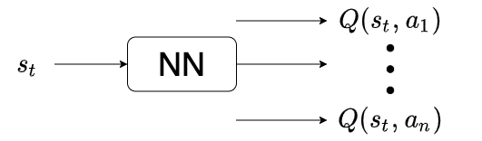
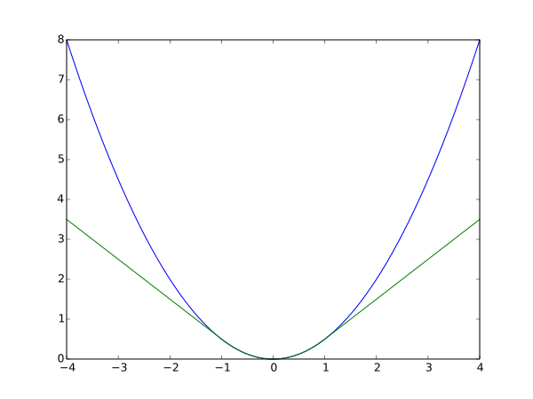
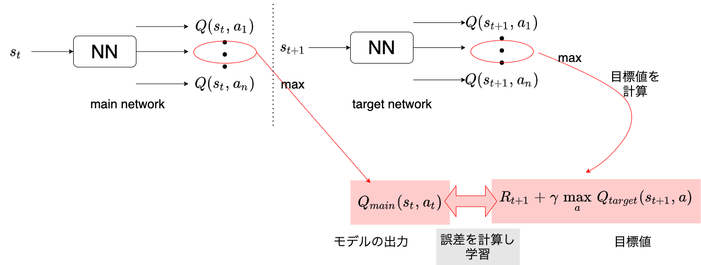
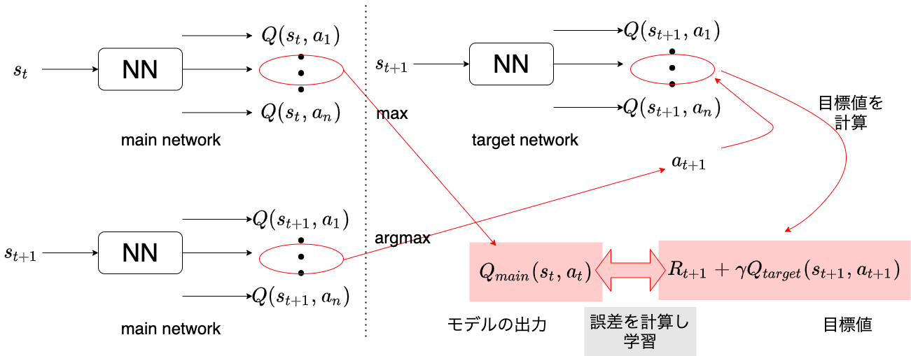
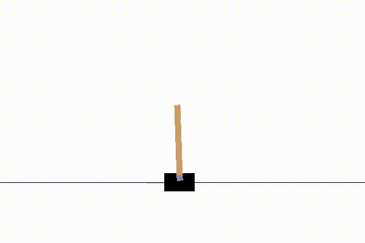
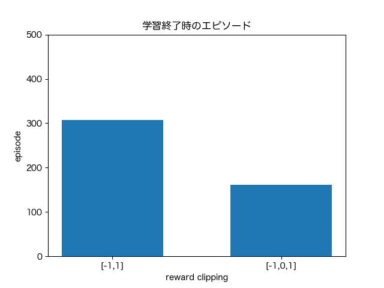
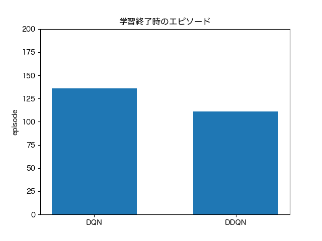

## 深層強化学習
- 2015年 Google の子会社ディープマインドが開発した DQN(Deep Q Network)が Atari2600（強化学習アルゴリズムのベンチマーク）のゲームほとんどで従来手法を上回った。
- 様々なテクニックを用いることで学習を安定させた初めての事例。
- [DQNからRainbowまで 〜深層強化学習の最新動向〜](https://www.slideshare.net/juneokumura/dqnrainbow)

---
## OpenAI Gym
- 強化学習の開発によく用いられるシミュレータ。様々な問題・環境を提供している。
https://gym.openai.com/envs/#classic_control
- Colab 上でレンダリングするために Xvfb（X virtual frame buffer）を使う。
- サンプル
https://colab.research.google.com/drive/1F_ZqogMyrh_7IbWEyhBgtVk3hfe5a6rP?usp=sharing

---
## DQN (Deep Q-Network)
- Q 関数を深層ニューラルネットワークで近似することで、状態変数が連続値でも扱えるようになる。また、CNN を使えば画像データの入力も可能となる。
- DQN では状態を入力として、各行動に対応する $Q(s,a)$ すべてを出力する。

- [第14回　深層強化学習DQN（Deep Q-Network）の解説](https://book.mynavi.jp/manatee/detail/id=89691)

---
## DQN (Deep Q-Network)
### 目標値
- 一般の教師あり学習では、訓練データのラベル（正解）を目標値として学習していた。
- 強化学習では以下を目標値として学習する。誤差関数については後述。
$$target = R_{t+1}+\gamma \max_{a'}Q_t(S_{t+1},a') $$

---
## DQN (Deep Q-Network)
### 工夫1：誤差関数
- 二乗誤差：TD 誤差の二乗に等しくなる。
- Huber 損失：二乗誤差は出力が大きくなりすぎて学習が安定しづらいため、誤差がある値以上のときは二乗せず絶対値をとる。
- [損失関数のまとめ(Huber,Log-Cosh,Poisson,CustomLoss,MAE,MSE)](https://qiita.com/Hatomugi/items/d00c1a7df07e0e3925a8)

---
## DQN (Deep Q-Network)
### 工夫2：Fixed Target Q-network
- 毎回教師データ（目標値）が変わると学習が安定しないので、ネットワークを2つ用意し、片方を一定期間固定して使う。
  - メインネットワーク：行動を選択するために使う。毎ステップ学習する。
  - ターゲットネットワーク：こちらのモデルの出力を教師データとして使う。一定期間毎にメインネットワークと重みを同期する。

---
## DQN (Deep Q-Network)
### 工夫2：Fixed Target Q-network
1. メインネットワークに現在の状態 $S_t$ を入力し、出力された $Q_{main}(S_t,a)$ をもとに行動を選択する。
$a_t = \argmax_aQ_{main}(S_t,a)$
2. 次状態 $S_{t+1}$ と報酬 $R_{t+1}$ を得る。
3. ターゲットネットワークに $S_{t+1}$ を入力し、出力された $Q_{target}(S_{t+1},a)$ をもとに目標値を計算する。
$target = R_{t+1}+\gamma \max_aQ_{target}(S_{t+1},a)$
4. メインネットワークは $Q_{main}(S_t,a), target$ をもとに重みを更新する。

---
## DQN (Deep Q-Network)
### 工夫2：Fixed Target Q-network

---

## DQN (Deep Q-Network)
### 工夫3：経験再生（Experience Replay）
- 状態・行動・報酬の系列をそのまま学習に用いると、直近の系列に偏った更新をしてしまい、学習が発散・振動しやすい。そこで、系列 $\{s,a,r,s'\}$ を貯めておき、Q 関数更新時にそこからサンプリングしたものを使うことで、学習が収束しやすくなる。これは方策オフ型でのみ使える。
- **warm up**：メインループ実行前に、ランダムな行動により経験を貯めておくこと。

---
## DQN (Deep Q-Network)
### 工夫4：reward clipping
- 報酬の値は Q 関数の推定に大きく影響する。そこで、学習を安定させるため、報酬の値を固定する。例えば以下のように設定する。
  - 成功時：1
  - 失敗時：-1
  - それ以外：0

---
## DQN (Deep Q-Network)
### Double DQN
- 行動の過大評価をより削減するため、目標値に使われる $Q(S_{t+1},a)$ の選び方を変える。
  - 従来のDQN：$\max_aQ_{target}(S_{t+1},a)$
  - DDQN：$Q_{target}(S_{t+1},\argmax_aQ_{main}(S_{t+1},a))$
- [ディープラーニングの最新動向 強化学習とのコラボ編②](https://www.slideshare.net/ssuser07aa33/introduction-to-double-deep-qlearning)

---
## DQN (Deep Q-Network)
### Double DQN
1. DQN と同様にして行動を選択する。
2. 次状態と報酬を得る。
3. **メインネットワークに次状態 $S_{t+1}$ を入力し、出力された $Q_{main}(S_{t+1},a)$ のうち最大値をとるような行動を取り出す。**
$a_{t+1} = \argmax_aQ_{main}(S_{t+1},a)$
4. ターゲットネットワークに $S_{t+1}$ を入力し、出力された $Q_{target}(S_{t+1},a)$ をもとに目標値を計算する。**このとき、3.で取得した行動に対応する Q 値を使う。**
$target = R_{t+1}+\gamma Q_{target}(S_{t+1},a_{t+1})$

---
## DQN (Deep Q-Network)
### Double DQN
5. メインネットワークは $Q_{main}(S_t,a), target$ をもとに重みを更新する。

---
## DQN (Deep Q-Network)
### 優先順位付き経験再生（Prioritized Experience Replay）
- [ディープラーニングの最新動向 強化学習とのコラボ編⑤](https://www.slideshare.net/ssuser07aa33/introduction-to-prioritized-experience-replay)
- 貯めた経験に優先順位をつけてサンプリングする。

---
## DQN で CartPole を学習させる

- 状態：4変数（カート位置、カート速度、棒の角度、棒の角速度）
- 行動：2つ（右に押す、左に押す）
- 終了条件：棒が倒れる（失敗）、または200ステップ立ち続ける（成功）。
- 5エピソード連続で成功（=1000ステップ）したら学習終了とする。

---
## DQN で CartPole を学習させる
- 報酬：以下の2通りを比較する。
  - 途中で倒れたら-1、それ以外は1。
  - 途中で倒れたら-1、200ステップ立ち続けたら1、それ以外は0。

- **報酬の設計が重要であることがわかる**

---
## DQN で CartPole を学習させる
- Double DQN と比較

