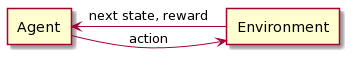

# 強化学習まとめ

---

## 用語定義
- 状態$s_t$：時刻$t$におけるシステムの状態
- 行動$a_t$：時刻$t$にエージェントの選択する行動
- 報酬$R_{t+1}$：行動$a_t$によってエージェントに与えられる報酬
- 方策$\pi(s_t,a_t)$：状態$s_t$で行動$a_t$を選択する確率
- 遷移確率$P_{ss'}^a$：状態$s$で行動$a$を選択したとき、状態$s'$に遷移する確率

---

## 価値の定量化
- 状態価値関数$V^\pi(s)$
  - 状態$s$における価値
  - 「状態$s_t$を起点に、方策$\pi$に従って行動したときの報酬の期待値」と定義する
- 行動価値関数$Q^\pi(s,a)$
  - 状態$s$で行動$a$を採る価値
  - 「状態$s_t$で行動$a_t$を選択した後、方策$\pi$に従って行動したときの報酬の期待値」と定義する

---

## 価値関数の定式化
- 状態価値関数
  - 簡易的に漸化式で表すと、以下のようになる
$$V^\pi(s_t) = R_{t+1} + \gamma V^\pi(s_{t+1})$$
  - 方策と遷移確率を考慮して期待値を計算すると、価値関数が導かれる（Bellman方程式）
$$V^\pi(s_t) = \sum_{a}\pi(s,a) \sum_{s'}P_{ss'}^a\{R_{ss'}^a + \gamma V^\pi(s')\}$$

---

