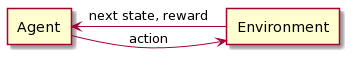
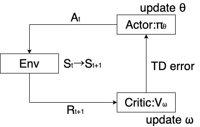

# 強化学習まとめ
- モデルベース
- モデルフリー

---
### 用語整理
- モデルベース：環境モデルの情報がわかっている。また、未知であっても、観測データから環境モデルを学習して活用する手法も含む。
  - 動的計画法：ベルマン方程式を解析的に解く
    - 方策反復法
    - 価値反復法
---
### 用語整理
- モデルフリー：環境モデルの知識を前提としない学習法
  - 価値ベース
    - Q学習
    - SARSA
  - 方策ベース
    - 方策勾配法
    - Actor-Critic（ハイブリッド）
---
### 用語整理
- 状態 $s_t$：時刻 $t$ におけるシステムの状態
- 行動 $a_t$：時刻 $t$ にエージェントの選択する行動
- 報酬 $R_{t+1}$：行動 $a_t$ によってエージェントに与えられる報酬
- 方策 $\pi(a|s)$：状態 $s$ で行動 $a$ を選択する確率
- 遷移確率 $p(s'|s,a)$：状態 $s$ で行動 $a$ を選択したとき、状態 $s'$ に遷移する確率
- 割引報酬和（収益、return）：$\sum_{k=1}^{\infty}\gamma^{k-1}R_{t+k}(0 \lt \gamma \lt 1)$

---
### 例
- 状態：$Home,Office,Bar$（終端状態なし）
- 行動：$move,stay$
- 報酬：例えば、 $r(Home,move,Bar) = +2$
- 方策：例えば、 $\pi(stay|Office) = 0.5$
- 遷移確率：例えば、 
$p(Office|Home,move) = 0.8$
$p(Bar|Home,move) = 0.2$
---

## 価値の定量化
- 状態価値関数 $v_\pi(s)$
  - 状態 $s$ における価値
  - 「状態 $s$ を起点に、方策 $\pi$ に従って行動したときの報酬の期待値」と定義する
- 行動価値関数 $q_\pi(s,a)$
  - 状態 $s$ で行動 $a$ を採る価値
  - 「状態 $s$ で行動 $a$ を選択した後、方策 $\pi$ に従って行動したときの報酬の期待値」と定義する

---

## （状態）価値関数の定式化
- 1ステップから期待される収益は以下で表される
$$r(s,a,s') + \gamma v_\pi(s')$$
- 方策と遷移確率を考慮して期待値を計算すると、価値関数が導かれる（Bellman方程式）
$$v_\pi(s) = \sum_{a}\pi(a|s) \sum_{s'}p(s'|s,a)\{r(s,a,s') + \gamma v_\pi(s')\} \cdots(1)$$

---
## （行動）価値関数の定式化
- (1)から $\pi(a|s)$ をとる
$$q_\pi(s,a) = \sum_{s'}p(s'|s,a)\{r(s,a,s') + \gamma v_\pi(s')\} \cdots(2)$$
- (1)(2)より、$v_\pi(s) = \sum_{a}\pi(a|s) q_\pi(s,a) \cdots(3)$
- (2)(3)より、
$$q_\pi(s,a) = \sum_{s'}p(s'|s,a)\{r(s,a,s') + \gamma \sum_{a'}\pi(a'|s') q_\pi(s',a')\}$$

---
## 最適ベルマン方程式
-  状態 $s$ において最適な方策をとったときの価値関数
$$v_*(s) = \max_\pi{v_\pi(s)}$$
$$q_*(s,a) = \max_\pi{q_\pi(s,a)}$$
と定義すると、以下で表される。**最適な行動は複数のときもある**。
$$v_*(s) = \max_{a \in A^*(s)}\sum_{s'}p(s'|s,a)\{r(s,a,s') + \gamma v_*(s')\}$$

---
- ベルマン方程式
$$v_\pi(s) = \sum_{a}\pi(a|s) \sum_{s'}p(s'|s,a)\{r(s,a,s') + \gamma v_\pi(s')\}$$
- 最適ベルマン方程式
$$v_*(s) = \max_{a \in A^*(s)}\sum_{s'}p(s'|s,a)\{r(s,a,s') + \gamma v_*(s')\}$$

---
## 動的計画法
- 方策反復法
  - 方策評価と方策改善の繰り返しで最適方策を得る。
- 価値反復法
  - 方策反復法ではベルマン方程式を解く計算コストが高いので、代わりに最適ベルマン方程式を解く。

---
### 方策反復法（Policy Iteration）
#### 方策評価ステップ
- (1) より以下のベクトル方程式が導かれる。
$$\boldsymbol{v} = \boldsymbol{R^\pi} + \gamma \boldsymbol{P^{\pi}v} \rarr \boldsymbol{v} = (1-\gamma \boldsymbol{P^\pi})^{-1}\boldsymbol{R^\pi}$$
ただし、
$[P^\pi]_{ss'} = \sum_a{\pi(a|s)p(s'|s,a)}$
$[R^\pi]_s = \sum_a{\pi(a|s)} \sum_{s'}{p(s'|s,a)r(s,a,s')}$

---
### 方策反復法（Policy Iteration）
#### 方策改善ステップ
$$\pi'(a|s) = \left\{
\begin{array}{ll}
1/|A^*(s)| & (for a \in A^*(s)) \\
0 & (otherwise)
\end{array}
\right.$$
ただし、$A^*(s) = a_* s.t. a_* = \argmax_{a}{q_\pi(s,a)}$
- $q_\pi(s,a)$ は(2)で計算する。

---
### 価値反復法（Value Iteration）
- 価値関数の更新
$$v_{t+1}(s) = \max_{a}{q_{t+1}(s,a)}$$
$$v_0(s) = 0(この初期値はあくまで例)$$
- 方策の更新
$$\pi_{t+1}(s) = \argmax_{a}{q_{t+1}(s,a)}$$
ただし、$q_{t+1}(s,a) = \sum_{s'}{p(s'|s,a)\{r(s,a,s')+\gamma v_t(s')\}}$

---
## モンテカルロ法
- 終端に至るまでの状態報酬系列 $\{S_t,R_t|t=0,1,\cdots,T\}$ をサンプリングして、そのときの収益 $G$ の平均値を推定値 $V$ として求める。
- エピソードが完結するまで計算できない。
- バイアス小、バリアンス大。
---
## モンテカルロ法
- **サンプリング時に $S_t,R_t$ （とそこから導かれる $G_t$）はわかっている**ため、以下を計算できる。

$V_{t+1}(s) = \frac{1}{N_{t+1}(s)}\sum_{k=0}^{t}G_k\boldsymbol{1}(S_k=s) \cdots (1)$
$N_{t+1}(s) = \sum_{k=0}^{t}\boldsymbol{1}(S_k=s) \cdots (2)$

(1)(2)より、以下が導かれる（ただし、$V_0(s) \equiv 0,N_0(s) \equiv 0$）
$V_{t+1}(s) = V_t(s) + \frac{1}{N_{t+1}(s)} \{G_t-V_t(S_t)\}\boldsymbol{1}(S_t=s)$
$N_{t+1} = N_t(s) + \boldsymbol{1}(S_t=s)$

---
## モンテカルロ法
ここで、$\frac{1}{N_{t+1}(s)} = \alpha_t$ （学習率）と一般化すると、上式は推定値 $V_t(S_t)$ を目標値 $G_t$ に近づけていると解釈できる。
$V_{t+1}(s) = V_t(s) + \alpha_t \{G_t-V_t(S_t)\}\boldsymbol{1}(S_t=s)$
- $\alpha_t$ が Robbins-Monro 条件を満たせば、$V_t(s)$ の収束性は保証されるが、実用上は十分に小さい $\alpha_t = \alpha$ （定数）として問題ない。

---
## TD 学習
- モンテカルロ法ではオンライン学習ができない。
- そこで、漸化式中の目標値 $G_t$ を１ステップ先の推定値に置き換える。
$$V_{t+1}(s) = V_t(s) + \alpha \{R_{t+1}+\gamma V_t(S_{t+1})-V_t(S_t)\}\boldsymbol{1}(S_t=s)$$
- $\delta_{t+1}=R_{t+1}+\gamma V_t(S_{t+1})-V_t(S_t)$ を**TD誤差**（Temporal Difference error）と呼ぶ。上式を書き換えたものが以下。
$$V_{t+1}(s) = V_t(s) + \alpha \delta_{t+1}\boldsymbol{1}(S_t=s)$$

---
## TD 学習
- 現時点の情報のみを使うので、漸化式が価値関数について自己完結的であり、**オンライン学習が可能**。

- バイアス大、バリアンス小。
- 以下の方法でTD学習を改善していく。
  - n-ステップTD学習
  - TD(λ)法、適格度トレース

---
## TD 学習
### n-ステップTD学習
- モンテカルロ法とTD学習の両方を取り入れたような方法。
- **n-ステップ収益**を定義し、これを目標値とする。
$$G_t^{(n)} = R_{t+1}+\gamma R_{t+2}+\cdots+\gamma^{n-1} R_{t+n}+\gamma^n V_t(S_{t+n})$$
漸化式を書き換えると、
$$V_{t+1}(s) = V_t(s) + \alpha \{G_t^{(n)}-V_t(S_t)\}\boldsymbol{1}(S_t=s)$$

---
## TD 学習
### n-ステップTD学習
- **オンライン学習不可**。
- $n \rarr \infty$のときモンテカルロ法
- $n = 1$のときTD学習

---
## TD 学習
### TD(λ)法
- モンテカルロ法とTD学習を統一的に扱うため、**$\lambda$-収益**を定義し、これを目標値とする。
$$G_t^{\lambda} = (1-\lambda)\sum_{n=1}^{T-t}{(\lambda^{n-1} G_t^{(n)})} + \lambda^{T-t}G_t$$
漸化式を書き換えると、
$$V_{t+1}(s) = V_t(s) + \alpha \{G_t^{\lambda}-V_t(S_t)\}\boldsymbol{1}(S_t=s)$$

---
## TD 学習
### TD(λ)法
- $\lambda$-収益 $G_t^{\lambda}$ は時刻 $t$ 以降の１ステップ収益,...,$T-t$ステップ収益を $\lambda$ のべき乗で加重平均したもの。

- $\lambda = 0$ のとき１ステップTD学習
- $\lambda = 1$ のときモンテカルロ法

---
## TD 学習
$V_{t+1}(s) = V_t(s) + \alpha \{R_{t+1}+\gamma V_t(S_{t+1})-V_t(S_t)\}\boldsymbol{1}(S_t=s)$

$V_{t+1}(s) = V_t(s) + \alpha \{G_t^{(n)}-V_t(S_t)\}\boldsymbol{1}(S_t=s)$

$V_{t+1}(s) = V_t(s) + \alpha \{G_t^{\lambda}-V_t(S_t)\}\boldsymbol{1}(S_t=s)$

---
## TD 学習
### TD(λ)法のオンライン学習（適格度トレース）
- まず、オンライン学習ができないことを示すため、n-ステップ TD 誤差を $\delta_t$ （1-ステップ TD 誤差）を使って表す。
$$G_t^{(n)}-V_t(S_t) = R_{t+1}+\gamma R_{t+2}+...+\gamma^{n-1} R_{t+n}+\gamma^n V_t(S_{t+n})-V_t(S_t) \\
= \sum_{k=t}^{t+n-1}\gamma^{k-t}\delta_{k+1}-\sum_{k=t}^{t+n-2}\gamma^{k-t+1}\{V_k(S_{k+1})-V_{k+1}(S_{k+1})\} \\
-\gamma^n\{V_{t+n-1}(S_{t+n})-V_t(S_{t+n})\}\\
= \delta_{t+1}+\gamma \delta_{t+2}+...+\gamma^{n-1}\delta_{t+n}+O( \alpha) \\
= (時点 t 以降のn 個の1-ステップ TD 誤差)+(\alpha に比例する誤差)$$

---
## TD 学習
### TD(λ)法のオンライン学習（適格度トレース）
- TD(λ)誤差についても上記と同様に計算すると、
$$G_t^{\lambda}-V_t(S_t) = \sum_{k=t}^{T-1}(\lambda \gamma)^{k-t}\delta_{k+1}+O(\alpha) \\
= \delta_{t+1}+(\lambda \gamma) \delta_{t+2}+...+(\lambda \gamma)^{T-t-1}\delta_T+O( \alpha) \\
= (時点 t 以降の T-t 個の1-ステップ TD 誤差)+(\alpha に比例する誤差)$$
- ここで、TD(λ)誤差の1エピソード$(t=0,1,...,T-1)$の総和をとる。
---
## TD 学習
### TD(λ)法のオンライン学習（適格度トレース）
$$\sum_{t=0}^{T-1}\{G_t^{\lambda}-V_t(S_t)\}\boldsymbol{1}(S_t=s) = \sum_{k=0}^{T-1}\delta_{k+1}E_{k+1}(s)+O(\alpha)$$
ここで、$E_{k+1}(s)$ を適格度トレース（eligibility trace）と呼び、以下で表される。
$E_{k+1}(s) = \sum_{t=0}^k(\lambda \gamma)^{k-t}\boldsymbol{1}(S_t=s) \\
= \boldsymbol{1}(S_k=s)+\lambda \gamma\boldsymbol{1}(S_{k-1}=s)+...+(\lambda \gamma)^k\boldsymbol{1}(S_0=s)$

---
## TD 学習
### TD(λ)法のオンライン学習（適格度トレース）
$$\sum_{t=0}^{T-1}\{G_t^{\lambda}-V_t(S_t)\}\boldsymbol{1}(S_t=s) = \sum_{k=0}^{T-1}\delta_{k+1}E_{k+1}(s)+O(\alpha)$$
- 左辺：前方観測的な見方（forward view）
- 右辺：後方観測的な見方（backward view）
- 適格度トレースによって（近似的に）オンライン学習が可能となる。

---
## TD 学習
### TD(λ)法のオンライン学習（適格度トレース）
- TD(λ)法のオンライン学習における更新式は以下。
$$V_{t+1}(s) = V_t(s)+\alpha \delta_{t+1}E_{t+1}(s) \\
E_{t+1}(s) = \lambda \gamma E_t(s)+\boldsymbol{1}(S_t=s)$$

- $\lambda = 0$ のとき、1-ステップTD学習
- $\lambda = 1$ のとき、モンテカルロ法（$O(\alpha)$ を無視すれば）

---
|手法|オンライン学習|
|:---:|:---:|
|モンテカルロ法|✖️|
|TD 学習|○|
|n-ステップ学習|✖️|
|TD(λ)法|✖️|
|適格度トレース|○|

---
## モデルフリーな制御
- 方策改善には行動価値の推定値 $Q_t(s,a)$ の計算が必要だが、モデルフリーな状況では遷移確率 $p(s'|s,a)$ がわからない。このようなとき、2つのアプローチが考えられる。
  - 価値ベース：$Q_t(s,a)$ をモンテカルロ法やTD(λ)法で直接推定して、この関数のもとで方策を改善
    - SARSA
    - Q 学習
  - 方策ベース：$\pi(a|s)$ を直接推定して、$V_t(s)$ による方策評価を参考にしつつ方策を改善
    - 方策勾配法

---
## Q 関数による制御
- 探索（exploration）：Q 値の推定に必要な情報を収集すること。
- 活用（exploitation）：探索結果から計算された Q 値が最大である行動を選択すること。
- 探索→活用の一方通行では運次第になってしまうので、バランスよく繰り返すことが重要。
- 以下のような方法がある。
### $\epsilon$-greedy法
### ボルツマン探索

---
## Q 関数による制御
### $\epsilon$-greedy法
$$\pi(a|s) = \left\{
\begin{array}{ll}
(1-\epsilon)/|A^*(s)|+\epsilon/M & (for a \in A^*(s)) \\
\epsilon/M & (otherwise)
\end{array}
\right.$$
ただし、$A^*(s) = a_* s.t. a_* = \argmax_{a}{Q(s,a)}$
- 学習が進むにつれて $\epsilon$ が減衰するような工夫も考えられる。

---
## Q 関数による制御
### ボルツマン探索
$$\pi(a|s) = \frac{exp(\beta Q(s,a))}{\sum_{a'}exp(\beta Q(s,a'))}$$
ただし、$\beta$ は温度パラメータ

---
## 方策オン/オフ型
- TD 誤差 $\delta_{t+1}=R_{t+1}+\gamma V_t(S'_{t+1})-V_t(S_t)$ に対して、
  - オン型：$S'_{t+1} = S_{t+1}$
  - オフ型：$S'_{t+1} \ne S_{t+1}$
- SARSA：方策オン型
- Q 学習：方策オフ型

---
## SARSA（方策オン型）
- TD(0)法によるQ関数の学習
$$\delta_{t+1} = R_{t+1}+\gamma Q_t(S_{t+1},A_{t+1})-Q_t(S_t,A_t) \\
Q_{t+1}(s,a) = Q_t(s,a)+\alpha \delta_{t+1}\boldsymbol{1}(S_t=s,A_t=a)$$

- TD 学習の更新式で $V_t(s)$ を $Q_t(s,a)$ に置き換えただけ。
- n-ステップTD学習やTD(λ)法にも拡張できる。
- n-ステップ収益
$$G_t^{(n)} = R_{t+1}+\gamma R_{t+2}+\cdots+\gamma^{n-1} R_{t+n}+\gamma^n Q_t(S_{t+n},A_{t+n})$$

---
## SARSA（方策オン型）
- SARSA(λ)
$$Q_{t+1}(s,a) = Q_t(s,a)+\alpha \{G_t^{\lambda}-Q_t(S_t,A_t)\}\boldsymbol{1}(S_t=s,A_t=a)$$
- 適格度トレース
$$Q_{t+1}(s,a) = Q_t(s,a)+\alpha \delta_{t+1}E_{t+1}(s,a) \\
E_{t+1}(s,a) = \lambda \gamma E_t(s,a)+\boldsymbol{1}(S_t=s,A_t=a)$$

- Q 関数は条件を満たせば最適行動価値関数 $q_*(s,a)$ に収束する。

---
## Q 学習（方策オフ型）
- 次時点の Q 関数の最大値を選ぶ。Q関数は $q_*(s,a)$ に収束する。
$$\delta_{t+1} = R_{t+1}+\gamma \max_{a'}Q_t(S_{t+1},a')-Q_t(S_t,A_t) \\
Q_{t+1}(s,a) = Q_t(s,a)+\alpha \delta_{t+1}\boldsymbol{1}(S_t=s,A_t=a)$$

- SARSA のように拡張は自明ではないが、**経験再生**という工夫
  - 観測される状態・行動・報酬系列において、前後の状態は強く相関しているため、直近の観測結果の影響を受けて推定値のバイアスが大きくなり、なかなか収束しないことがある。
  - そこで、観測された系列を溜めておき、Q関数推定時に無作為に抽出するというアイデア。

---
## 方策ベース手法
- 行動空間が高次元、連続でも有効。
  - 価値ベースでは $Q(s,a)$ の最大値を見つけるために全ての行動に対して計算する必要があったが、方策ベースでは状態 $s$ を入力すると行動 $a$ が出力される。
- 決定論的方策だけでなく、確率的方策も学習できる。
- 局所最適解に陥りやすい。
- バリアンス大。

---
## 方策のパラメータ表現
- 入力 $s$ 、出力 $a$ の確率分布関数として方策 $\pi$ をモデル化する。
  - 例）ギブス方策（$\theta$：パラメータ、$\xi$：特徴量）
    - 行動空間が離散であるときしか適用できない。
$$\pi(a|s,\theta) = \frac{exp(\theta  \xi(s,a))}{\sum_{a'}exp(\theta \xi(s,a'))}$$

- 行動空間が連続のときはガウス方策などが考えられる。

---
## 方策勾配法
- 最適な方策を学習するためには、方策の更新式、つまりパラメータの更新式が必要。
- パラメータ $\theta$ の更新式は以下。
$\theta_{t+1} = \theta_t+\alpha \nabla_{\theta}J(\theta_t)$
ただし、$J(\theta)$：目的関数、$\nabla_{\theta} \equiv (\frac{\partial}{\partial \theta_1},...,\frac{\partial}{\partial \theta_M})^T$

- 目的関数をどうするか：学習開始時の状態 $s_0$ での期待収益、つまり $\pi(a|s_0,\theta)$ のもとで計算された価値関数 $v_{\pi}(s_0)$ と定義し、これを最大化すればよさそう。
$J(\theta) = v_{\pi}(s_0) \equiv E_{\pi}[G_t|S_t=s_0]$

---
## 方策勾配法
### 方策勾配定理
$\nabla_{\theta}J(\theta) = E_{\pi}[\nabla_{\theta}\log \pi(a|s,\theta)q_{\pi}(s,a)]$
- $\pi(a|s,\theta)$：$\theta$ についての尤度
- $\nabla_{\theta}\log \pi(a|s,\theta)$：スコア関数
- $q_{\pi}(s,a)$：重み

---
## 方策勾配法
### アドバンテージ関数
$a_{\pi}(s,a) = q_{\pi}(s,a)-v_{\pi}(s)$
- Q 関数は $s$ と $a$ 両方に依存するため、変数ごとのバリアンスが重なってQ 関数のバリアンスを大きくしている。
- そこで、状態空間のバリアンスを吸収するベースライン関数 $b(s)(=v_{\pi}(s))$ を導入する。

---
## 方策勾配法
### アドバンテージ関数
$a_{\pi}(s,a) = q_{\pi}(s,a)-v_{\pi}(s)$
- 方策勾配定理の $q_{\pi}(s,a)$ を $a_{\pi}(s,a)$ に置き換える。
$\nabla_{\theta}J(\theta) = E_{\pi}[\nabla_{\theta}\log \pi(a|s,\theta)\{q_{\pi}(s,a)-v_{\pi}(s)\}]$
- 実際にはサンプリングされた系列、推定値で近似する。
$\nabla_{\theta}J(\theta) \approx \frac{1}{T}\sum_{t=0}^{T-1}\nabla_{\theta}\log \pi(A_t|S_t,\theta)\{Q(S_t,A_t)-V(S_t)\}$
- Q 関数を TD(0)法の目標値で置き換えると、アドバンテージ関数=TD誤差。モンテカルロ法の収益 $G_t$ で近似すると、REINFORCE アルゴリズム。

---
## Actor-Critic 法
- 方策ベース手法が効力を発揮する高次元（連続）な行動空間に対しては、Q 関数も方策同様にパラメータと特徴量によるモデル化が必要。
- 行動器（Actor）：方策改善を担う。方策 $\pi(a|s,\theta)$ にしたがって行動 $A_t$ をサンプリングする。また、Critic から Q 関数を受け取り、方策パラメータ $\theta$ を更新する。
- 評価器（Critic）：方策評価を担う。報酬 $R_{t+1}$ をもとに、パラメータ $\omega$ でモデル化された $Q_{\omega}(s,a)$ を学習して $\omega$ を更新する。

---
## Actor-Critic 法

1. Actor は方策 $\pi(a|s,\theta)$ にしたがって行動 $A_t$ をサンプリングする。
2. Critic は報酬 $R_{t+1}$ をもとに、価値関数のパラメータ $\omega$ を更新する。
3. Actor は Critic から TD 誤差を受け取り、方策パラメータ $\theta$ を更新する。

---
## Actor-Critic 法
### Actor のモデル化
- 行動空間が連続のときは、ガウス方策によるモデル化が考えられる。
- 一連の状態・行動系列を生成するとき、RNN によるモデル化が考えられる。

---
## Actor-Critic 法
### Critic のモデル化
- 行動空間がこうじげん（連続）だと、Q 関数の計算が大変なため、実際には価値関数をパラメータ $\omega$ でモデル化した $V_{\omega}(s)$ を学習する。
- TD 学習を採用するとしたら、二乗和を損失関数とすればよさそう。
$L_{critic}(\omega) = \sum_{t=0}^{T-1}|\delta_{t+1}(\omega)|^2$
ただし、$\delta_{t+1}(\omega) = R_{t+1}+\gamma V_{\omega}(S_{t+1})-V_{\omega}(S_t)$

---
## Actor-Critic 法
### Critic のモデル化
- TD 誤差の $\pi$ に関する期待値はアドバンテージ関数に等しくなる。
$E_{\pi}[\delta] = E_{\pi}[q_{\pi}(s,a)-v_{\pi}(s)], \delta = r+\gamma v(s')-v(s)$
- よって、Actor の学習に用いる方策勾配法の損失関数は以下。
$L_{actor}(\theta) = -\frac{1}{T}\sum_{t=0}^{T-1}(\log \pi(A_t|S_t,\theta))\delta_{t+1}(\omega)$

---
## Actor-Critic 法
### バッチ学習
- 1ステップごとに更新すると、価値関数の推計誤差が大きくなり、収束に時間がかかるため、バッチ単位で更新するのが望ましい。
$$L_{critic}(\omega) = \sum_{t=0}^{T-1}|\delta_{t+1}^{(T-t)}(\omega)|^2\\
L_{actor}(\theta) = -\frac{1}{T}\sum_{t=0}^{T-1}(\log \pi(A_t|S_t,\theta))\delta_{t+1}^{(T-t)}(\omega)$$
ただし、$\delta_{t+1}^{(n)} = \delta_{t+1}+\gamma \delta_{t+2}+...+\gamma^{n-1}\delta_{t+n}$

---

### メモ
- 行動を表す変数が高次元だったり連続だったりすると、Q学習が難しくなる→行動価値を推定するよりも行動の確率分布を記述する方策を学習するほうが有効→方策勾配法、Actor-Critic
- Robbins-Monro 条件
$\sum_{t=0}^{\infty}\alpha_t = \infty, \sum_{t=0}^{\infty}\alpha_t^2 \lt +\infty$

---
